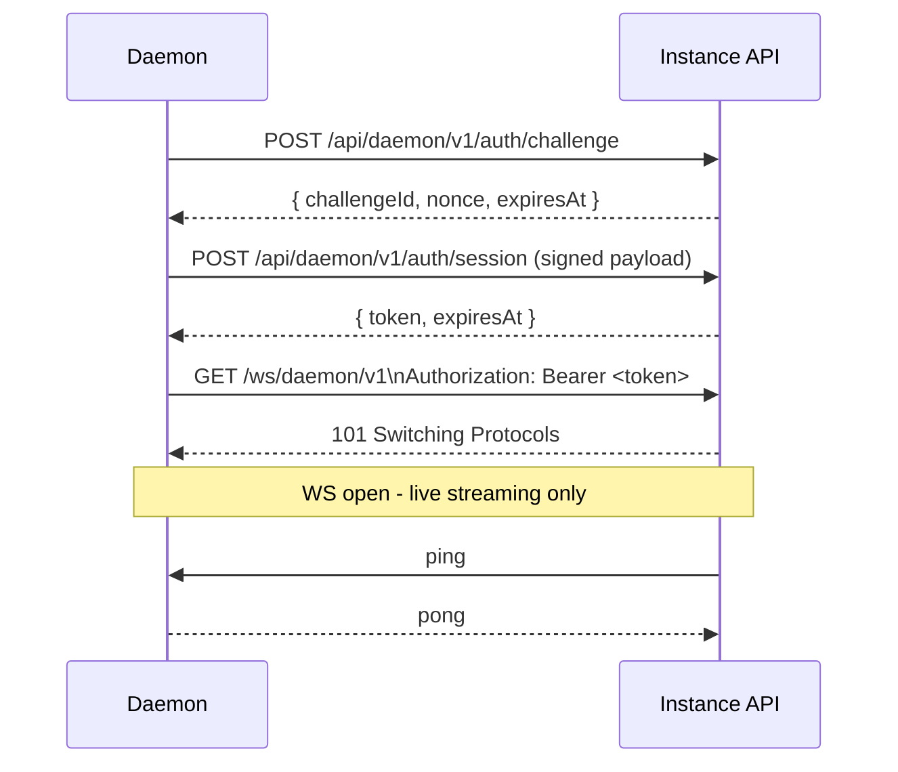

# Authentication — AGENTS.md

Custom PAM-style auth on the Web Crypto API (runs on both Deno and Workers): Argon2id password hashing, opaque DB-backed sessions with signed cookies, the host PAM install gate, the session-secret keyring + `tpsecret`/`tpdaemon` data encryption, daemon key authentication (Ed25519 JWT), and all client/install auth routes.

Root context: `../../../AGENTS.md`. Daemon-side key verification files live under `../../daemon/authn/`; daemon cell + license lifecycle: `../../daemon/cell/AGENTS.md`.

## Authentication

The instance uses a **custom PAM-style auth model** built entirely on the **Web Crypto API** (`crypto.subtle`, `crypto.getRandomValues`). There is no dependency on Node.js crypto or `nodejs_compat` mode — the same primitives run on both Deno and Cloudflare Workers.

**`nodejs_compat` is enabled** in `wrangler.jsonc` as a toolchain compatibility shim (required for drizzle-kit and postgres.js during the migration step). **Rarely use Node.js APIs in application code** — always prefer Cloudflare-native APIs: Web Crypto API (`crypto.subtle`, `crypto.getRandomValues`), Cloudflare Cache API, etc. Do not use `nodejs_compat` as justification for pulling in Node.js-specific libraries in application routes.

### Password hashing

Credential-account passwords use **Argon2id** via `@noble/hashes` (`src/client/authn/password.ts`) — pure TypeScript, no WASM loader, runs on both Deno and Cloudflare Workers. Stored PHC format: `$argon2id$v=19$m=<m>,t=<t>,p=<p>$<b64-salt>$<b64-hash>`. New hashes use the OWASP 2026 minimum baseline **`m=19456,t=2,p=1`** (~19 MiB working set, well under the default 128 MiB Workers isolate limit). Verification re-derives the digest as bytes and compares with XOR-accumulation constant-time equality — do **not** delegate final equality to library `argon2Verify` helpers. Do not use plain SHA-256 or PBKDF2 for new passwords.

**NIST vs OWASP decision (picked the stronger option):** Argon2id is cryptographically stronger against offline GPU/ASIC cracking. NIST SP 800-63B-4 requires a memory-hard verifier (SHOULD) and SP 800-132's PBKDF2 is the FIPS-friendly-but-weaker path; TurboPanel is non-FIPS, so OWASP's concrete Argon2id floor wins. PBKDF2 was deliberately **not** chosen "for NIST," and Workers SubtleCrypto PBKDF2@100k was rejected (fails OWASP's ≥600k floor).

**Pre-MVP hard cutover:** no migration, no legacy PBKDF2 verify, no dual-format storage, no lazy rehash. Old `$pbkdf2-sha256$…` hashes fail verification — wipe/recreate test accounts.

**Boot behavior + raise-only override:** both `src/workers.ts` (per-isolate `initWorkerApp`) and `src/deno.ts` (before `Deno.serve`) call `assertPasswordHasherAvailable()` and fail fast rather than degrading. Optional raise-only override via `configureArgon2idWorkFactor` — `TURBOPANEL_ARGON2ID_MEMORY_KIB` / `TURBOPANEL_ARGON2ID_TIME_COST` may only raise `m`/`t` above the OWASP floor (values below the floor are ignored with a warning).

**Daemon key authentication:** daemon auth now starts with HTTP-first enrollment/session issuance, then uses a short-lived stateless daemon JWT for protected daemon REST and daemon WebSocket upgrade authentication.

- **Enrollment challenge + proof**: daemon requests `POST /api/daemon/v1/auth/challenge` (no credentials), signs `buildEnrollmentPayload()` (`turbopanel-daemon-enroll-v1` canonical format), then calls `POST /api/daemon/v1/enroll` with `{ licenseId, licenseToken, publicJwk, challengeId, signature, serverId? }`. The instance verifies license + proof-of-possession, resolves/creates `server`, and stores the daemon public key on the server row. Licenses are one-shot: after a server latches, re-enroll requires the persisted `serverId`; a fresh license always creates a new server.
- **Auth challenge + session token**: enrolled daemon requests `POST /api/daemon/v1/auth/challenge` with `{ serverId, keyId }`, signs `buildAuthPayload()` (`turbopanel-daemon-auth-v1` canonical format), then calls `POST /api/daemon/v1/auth/session` to receive a **15-minute stateless JWT**. Session issuance records key use in Postgres (`touchDaemonKeyLastUsed` on `server.daemon.key.lastUsedAt`) only — it does **not** call `DaemonCell.putSnapshot()` or wake the cell.
- **JWT enforcement**: protected daemon REST routes use `requireDaemonJwt` middleware (`Authorization: Bearer <token>`) on `/commands/lease`, `/secrets/decrypt`, and `/metrics`; exempt routes include `GET /readiness`, `GET /instance/ca`, `GET /jwks.json`, `GET /openapi.json`, `GET /reference`, `POST /auth/challenge`, `POST /enroll`, and `POST /auth/session`. JWT verification checks signature, expiry, and claims; `/metrics` and `/secrets/decrypt` additionally require the JWT `sub`/`kid` to still match an active daemon key (post-revocation JWTs are rejected even before expiry).
- **Rate limits (Workers)**: `DAEMON_REST_RATE_LIMITER` gates `/auth/challenge` (by `serverId` when present; anonymous enrollment challenges use the stable `enroll-challenge` sentinel via `daemonEnrollChallengeRateLimitKey`), `/enroll` (by `licenseId`), `/auth/session` (by `serverId`), `/commands/lease`, and `/secrets/decrypt`. `DAEMON_METRICS_RATE_LIMITER` gates `/metrics` (`daemonMetricsRateLimitKey(serverId)`, `{ limit: 3, period: 60 }`). Public reads (`/readiness`, `/instance/ca`, `/jwks.json`, `/openapi.json`, `/reference`) are unlimited. `DAEMON_CONNECT_RATE_LIMITER` gates the `/ws/daemon/v1` upgrade after JWT verify and before the cell wakes. Shared keys live in `src/daemon/rate-limit/`; missing daemon limiter bindings fail closed on production-like Workers.
- Remote WSS connections require a valid daemon JWT at upgrade time; unauthenticated server row creation from `hostname`/`machineId` alone is disallowed.
- Co-located socket daemons use the same auth model; there is no unauthenticated bypass.
- `DAEMON_INBOUND_ALLOWED` in `src/daemon/cell/protocol.ts` is a static set of accepted post-auth message types — not an authz system.
- Daemon identity is stored on the `server` row as typed jsonb `server.daemon` (`key` only). Hot-path timestamps live in `server.daemon_key_last_used_at` and `server.last_seen_at`. No `serverkey` or `daemonsession` tables.
- Re-enrollment of an already-latched license requires the daemon's persisted `serverId` and replaces `server.daemon` entirely; old daemon keys are not kept for MVP. A different host cannot reuse a consumed license — mint a new key via Add Server.
- JWT payload: `sub` (serverId), `kid` (`server.daemon.key.id`), `jti` (random uuid, logging only), `iss`, `aud`, `typ`, `iat`, `exp`. No `sid`. Daemon JWTs are **EdDSA (Ed25519)** signed; header carries `alg: "EdDSA"`, `typ: "JWT"`, and a string `kid` (SHA-256 fingerprint of the public JWK). Verification selects the public key by `kid`.
- Revoking daemon auth: set `server.daemon.key.revokedAt`. Existing JWTs remain valid until their 15-minute expiry. New JWT issuance fails.

Do-not-retry-soon mapping for enroll/session responses (daemon intent):

| Status + message (`/enroll`, `/auth/session`) | Daemon action |
| --- | --- |
| `401 Invalid license` | permanent → daemon parks (5 min–1 h backoff) |
| `400 License already consumed or invalid` | permanent → daemon parks |
| `400 License is inactive` | permanent → daemon parks |
| `400 License tier below required` | permanent → daemon parks |
| `400 License tier not assigned` | permanent → daemon parks |
| `400 Server key is inactive` | permanent → daemon parks |
| `403 Invalid signature` / `409 Fingerprint already exists` | permanent → daemon parks |
| `404 Server key not found` / `400 Server key mismatch` | stale-identity → recoverable re-enroll (keeps persisted `serverId`) |
| `429` / `5xx` / `400 Invalid or expired challenge` | transient → normal full-jitter reconnect |

The daemon-side parked state (not `DAEMON_REST_RATE_LIMITER`) is the primary protection against enroll/challenge storms after a control-plane identity loss (e.g. DB wipe); `DAEMON_REST_RATE_LIMITER` remains a backstop that must behave even when limits fail open. Canonical daemon backoff/unpark behavior: **`../turbopaneld/AGENTS.md`** (Instance client → parked state) — do not duplicate it here.



### Session model

Sign-in is **email-only** (the legacy `user.username` / `displayUsername` columns were removed). The session payload does not include `username`.

Sessions are **opaque DB-backed tokens** with a signed cookie:

- A 32-byte random token is generated and stored in the `session` table (`token`, `userId`, `expiresAt`, `ipAddress`, `userAgent`).
- The cookie value sent to the browser is `tpsession.v<version>.<token>.<sig>`, where the signature is computed over the raw token using the session secret for that version.
- On every request the signature is verified first (constant-time); only then is the DB queried for the session row. A cookie value that does not parse as this envelope is rejected outright (no fallback formats).
- Cookie name: `turbopanel.session_token` on HTTP, `__Host-turbopanel.session_token` on HTTPS (resolved from the request URL in `src/client/authn/crypto.ts`). `__Host-` requires `Secure`, `Path=/`, and no `Domain` (stronger against subdomain cookie shadowing).
- Cookie attributes: `HttpOnly; SameSite=Lax; Path=/; Max-Age=604800` (7 days). `Secure` is added automatically when the request URL is HTTPS.
- Native / Expo app clients use this **same cookie session** against an absolute control-plane origin (`credentials: include`). Do **not** add a user-session Bearer; Bearer remains daemon JWT / API-key territory.

### Host PAM install gate (Deno only, install wizard)

On the **Deno runtime**, initial setup is gated by host PAM — **`root`** or any user in the **`sudo` / `wheel` / `admin`** groups. Host auth **never** receives a session or cookie. In **production** the instance process runs as **`tpctrl`**; in **development** it runs as the dev user. It spawns **`sudo -n /usr/bin/pamtester login <username> authenticate`** directly and writes the password on **stdin** (never via a child-env var or `/bin/sh` pipeline — see `src/client/authn/credentials.ts`). **`pamtester`** must be installed on managed hosts (the daemon `daemon-prereqs` role). Sudoers: **`tpctrl`** gets `NOPASSWD: /usr/bin/pamtester login * authenticate` in `instance-launch` `upgrade-sudoers.yml` (production). The instance systemd unit must grant **`--allow-run=/bin/sh,sudo,/usr/bin/sudo,pamtester,/usr/bin/pamtester`**.

**Dev mode bypass (`TURBOPANEL_DEV_HOST_AUTH=group-only`):** Honored **only** when `isExplicitDevelopmentMode()` is also true (`TURBOPANEL_DEV_SURFACE=1`, or the strict pair `TURBOPANEL_MODE=development` + `TURBOPANEL_UI_MODE=dev`). When both are set, `verifyInstallHostCredentials` skips `verifyPamLogin` entirely. The password field must still be non-empty (the UI requires it), but it is not verified against PAM. Group membership (`sudo`/`wheel`/`admin`) is still checked via `id -nG`; the `root` username shortcut is kept only inside this explicit-dev branch. **Production never honors this variable** — if it is set outside explicit development mode it is ignored and a warning is logged. Dev converge injects the var automatically; managed production hosts must never set it. `pamtester` is only required on managed hosts (installed by the daemon `daemon-prereqs` role).

**Install flow:** `POST /api/install/v1/bootstrap` verifies host PAM and returns `{ ok: true }` only (no cookies). The UI keeps host username/password in the form and reveals superadmin fields client-side. `POST /api/install/v1/` re-verifies host PAM, creates org (**Root Organization**) + team (**Default Team**) + workspace (**Default Workspace**) + **superadmin** user (`role: superadmin`, email + credential `account`), provisions a latched colocated server seat (`this server`) + license credentials (including `server.id` on disk), ensures the self-host system hierarchy, and returns a signed session cookie for the superadmin only. Host accounts cannot sign in via `/auth/sign-in`. This path is **never active on Workers**.

Superadmin-only routes (`createRootOnlyMiddleware`, `resolveRootSession`) authorize by **`user.role === 'superadmin'`**, not PAM root. `user.role` ∈ `superadmin | admin | user` is **instance authority only** and is distinct from resource access profiles. **`superadmin` and `admin`** both bypass resource authorization checks — `can()` and `listVisible()` short-circuit in SQL without requiring any `grant` rows. Future superadmin-only platform operations (developer reset-dev, etc.) remain restricted to `superadmin` via middleware, not `admin`.

### Session secret configuration

Both runtimes resolve the same root secret via `parseSecretsFromEnv()`:

- **`TURBOPANEL_SECRET`** — the normal single current secret (bare 48-char value, treated as version 1). This is what production Workers bind in the Cloudflare dashboard.
- **`TURBOPANEL_SECRETS`** — optional versioned keyring for rotation, in the **exact order given**. The **first entry is current/signing**; the rest are decrypt/verify-only fallbacks. Versions are labels for envelopes (`tpsecret.v<n>…`); **entry order** decides current vs fallback — not “highest version wins.” Operators should list highest version first (e.g. `2:secret,1:secret`); if entries are not already in descending-version order, boot logs a **warning only** and still treats the written first entry as current. When this var is set it is the full keyring and takes precedence over `TURBOPANEL_SECRET`.

**First entry signs / all keys verify.** Every key yields a stable `kid`; JWT headers include the active `kid`.

`deriveSecretsConfig()` HKDF-derives HMAC keys for `session-signing` and `daemon-challenge-signing`. `deriveEncryptionSecretsConfig()` derives AES-256-GCM keys for `data-encryption`. The **daemon-facing JWT** uses `deriveDaemonJwtKeyring()` (`src/daemon/authn/daemon-jwt-keyring.ts`: Ed25519, HKDF salt `turbopanel`, info `daemon-jwt-eddsa`) — the legacy HMAC `daemon-jwt-signing` purpose is no longer used for daemon JWTs.

**JWKS** (`GET /api/daemon/v1/jwks.json`) publishes all currently-valid **public** Ed25519 verification keys only — never `TURBOPANEL_SECRET` / `TURBOPANEL_SECRETS` or any HMAC key material. Old keys stay in JWKS during rotation and are removed once old tokens expire (≤15 min).

**Rotation:** set `TURBOPANEL_SECRETS` to `2:new,1:old`, deploy, old tokens verify during their ≤15-min window, then drop the old key from the keyring/JWKS (or go back to a single `TURBOPANEL_SECRET`).

| Variable | Behaviour |
| --- | --- |
| `TURBOPANEL_SECRET` | Single current secret (bare value → version 1). Required in production unless the keyring is set. |
| `TURBOPANEL_SECRETS` | Optional versioned list `2:secret,1:secret` — order as written; first entry is current/signing. Used when rotating. |

| Runtime | Source |
| --- | --- |
| Deno | `TURBOPANEL_SECRET` and/or `TURBOPANEL_SECRETS` (`instance-launch` injects the keyring on managed hosts) |
| Workers | Same names as Wrangler secrets / `.dev.vars` (Ansible emits `TURBOPANEL_SECRETS` into `runtime.dev-vars`; `scripts/workers-serve.sh` symlinks it to checkout `.dev.vars`) |

**Root secret format:** 48 characters from `[A-Za-z0-9_]`, always at least one `_` between positions 2–47 (never in position 1 or 48). Implementation: `scripts/generate-secret.mjs` (re-exported from `src/generate-secret.ts`). Generate with `pnpm generate:secret` in `instance/`. HKDF uses the UTF-8 bytes of the string as key material (`deriveKey` in `src/client/authn/secrets.ts`). Same helper (`generatePassword`) is the canonical generator for random passwords.

`TURBOPANEL_SECRET` (or `TURBOPANEL_SECRETS` while rotating) must be set in production. Workers always fail fast when both are missing. Co-located dev Ansible (`instance-launch`) persists `/etc/turbopanel/instance/.instance_secrets` (versioned keyring, `<version>:<value>` comma-separated, highest first) — `root:<turbopanel_group>` mode `0640` so the dev console can HMAC Local-Console developer API calls — and emits it into `runtime.dev-vars` as `TURBOPANEL_SECRETS` for **both** Deno and Workers runtimes so session cookies and daemon JWTs survive runtime toggles; the Deno unit also loads `runtime.dev-vars` via `EnvironmentFile`. Rotation is the opt-in extra-var `turbopanel_instance_secret_rotate` (ordinary converges never rotate). Without that file, Deno co-located dev (`TURBOPANEL_UI_MODE` ≠ `static`) falls back to an ephemeral random key (sessions do not survive restarts or switches).

For manual `pnpm dev` outside converge, add a `TURBOPANEL_SECRET=` line (or a `TURBOPANEL_SECRETS` keyring) to the checkout `.dev.vars`; converge-managed runs get it from `/etc/turbopanel/instance/runtime.dev-vars` automatically.

### Local-Console HMAC (co-located dev terminal)

When the developer surface is enabled (`TURBOPANEL_DEV_SURFACE=1` or `TURBOPANEL_MODE=development` + `TURBOPANEL_UI_MODE=dev`), `createDeveloperAccessMiddleware` accepts either a superadmin session cookie **or** an HMAC `Authorization: Local-Console …` credential from the Ink console over the Unix socket (`src/developer/local-console-auth.ts`; client: `~/dev/src/lib/developer-client.ts`).

**Canonical request (NUL-separated UTF-8 payload):**

```text
local-console-v1\0<timestamp>\0<METHOD>\0<requestTarget>\0<contentSha256>
```

| Field | Meaning |
| --- | --- |
| `timestamp` | ISO-8601 issue time (also base64url-encoded as the first token segment); max skew **60s** |
| `METHOD` | Uppercased HTTP method |
| `requestTarget` | Pathname **plus query string** (e.g. `/api/developer/v1/daemon/sync-dev?force=1`) — not path alone |
| `contentSha256` | base64url(SHA-256(raw body bytes)); empty body uses the empty-string digest |

**Wire format:**

- `Authorization: Local-Console <timestampB64url>.<hmacSha256B64url>`
- `X-Local-Console-Content-SHA256: <contentSha256>` — digest is part of the signed payload so captured headers cannot be replayed against a different body/query/method/path
- For `POST`/`PUT`/`PATCH`/`DELETE`, the instance verifies the digest against a **cloned** request body so route handlers can still read the original stream

Local-Console auth is Deno + developer-surface only; it never applies on Workers production.

### Data encryption

`tpsecret` is the **universal at-rest format** for all persisted secrets (secret variables, TLS private keys, principal passwords, email secrets). Shared symmetric encryption is keyed off the same root secret via HKDF (`info: "data-encryption"` → AES-256-GCM). Envelope format: `tpsecret.v<version>.<payloadB64u>` where `payload` = IV (12 bytes) ‖ ciphertext+tag. The embedded version enables direct lookup against `DerivedSecretsConfig.current` / `.fallbacks` during rotation — no trial decryption. Every TurboPanel-authored serialized secret shares grammar `<scheme>.v<version>.<fields…>`; `src/client/authn/envelope.ts` is the single owner of format/parse (`formatEnvelope` / `parseEnvelope` / `hasEnvelopeScheme`) — no module hand-rolls `split(".")`. Bump the version token when the payload layout changes; the scheme identifies the purpose. There are **no per-server at-rest keys**: a single `TURBOPANEL_SECRET` root of trust yields a rollable data-encryption keyring. A credential sealed as `tpsecret` is server-agnostic at rest and can be delivered to any authorized daemon.

**OTP verifiers** use `tpotp.v<n>.<hmacHex>` (HMAC material unchanged): direct-version lookup plus a rotation-safety sweep across remaining keyring entries.

**Delivery:** at deploy/delivery time the instance decrypts the at-rest `tpsecret` envelope and re-seals it as a recipient-bound `tpdaemon.v<version>.<serverId>.<keyId>.<payloadB64u>` envelope via the shared `resealSecretForDaemon` helper (`src/client/authn/data-encryption.ts`). Daemons decrypt only those recipient-scoped envelopes through `POST /api/daemon/v1/secrets/decrypt` (daemon JWT). Global `tpsecret` blobs are never handed to daemons.

**Git provider App credentials:** registered GitHub Apps and GitLab OAuth applications live in the **`gitapp`** table (`src/lib/git/forge-records.ts`), one row per application — an instance may hold several, scoped instance-wide (`organization_id IS NULL`) or to one organization. Each row's `credentials` jsonb holds the App private key, the OAuth client secret, and the webhook secret, each sealed as `tpsecret` exactly like TLS private keys — never plaintext at rest, and never returned by either API surface (`/api/admin/v1/forges` and `/api/client/v1/forges` report presence only). **Installation access tokens are minted on demand and never persisted**: `src/lib/git/github-app-token.ts` signs a ≤10-minute RS256 App JWT with Web Crypto (`RSASSA-PKCS1-v1_5` / SHA-256; PKCS#1 PEMs are wrapped into PKCS#8 locally, no Node `Buffer`), exchanges it for an installation token, hands the token to the caller in memory, and writes it nowhere — resolving the signing key from the app named by `installation.app_id`, not from a singleton. The install redirect carries a signed `state` (`tpinstall.v<version>.<payloadB64u>.<sigB64u>`, HKDF purpose `github-app-install-state`) naming both the organization *and* the application, so neither can be forged; the manifest flow uses the same envelope under a distinct purpose (`github-app-manifest-state`). The GitLab webhook token is additionally indexed by a domain-separated SHA-256 digest so an unscoped delivery can be routed in one lookup — the digest finds the row, the sealed value still authenticates it.

**Boundary:** client/UI code imports only `encryptSecret` / `generateSealedSecret` for at-rest sealing (can generate a secret and show plaintext once); decryption is not exposed on the client surface. The symmetric key never leaves the instance.

**Rotation:** writing or updating a secret always seals under the current key version (**lazy re-seal-on-write**). After rotating the keyring (`TURBOPANEL_SECRETS`), new writes use the new version immediately; existing rows sealed under older versions remain decryptable via fallbacks until rewritten.

**Superadmin re-encrypt sweep** (`POST /api/admin/v1/secrets/reencrypt`, `src/admin/reencrypt-secrets.ts`):

- **Bounded batches:** each request scans at most `limit` blobs (default/cap 200) across stages `variables` → `tls` → `principals` → `email`. Response includes per-batch `{ scanned, reencrypted, skipped, failed, completed, cursor }`. When `completed` is false, resume with the returned `cursor` until `completed` is true. A durable `setting`-row lease (`REENCRYPT_SWEEP_LOCK`, owner + expiry) returns **409** `reencrypt_in_progress` if a second sweep overlaps — this works across Workers isolates and Deno processes, not only within one isolate.
- **`variable.value` / `tls.privateKeyPem` / `principal.password`:** re-seal older-version `tpsecret` under the current key; **skip** already-current `tpsecret` and **valid** daemon-bound `tpdaemon`; **fail** plaintext, malformed `tpsecret`/`tpdaemon`, and decrypt errors. Valid `tpdaemon` is left untouched on purpose (delivery envelopes, not at-rest rotation targets).
- **`SYSTEM_EMAIL` secret keys** (`MAILGUN_API_KEY` / `SMTP_PASS`): re-seal older-version `tpsecret` only; plaintext / non-`tpsecret` material is **failed** (not auto-migrated).
- Each write is conditional on the original value still being present (id + secret-column compare-and-swap) so a concurrent update during rotation is left untouched and counted as `skipped`.

**CORS (Scalar / docs site):** when `TURBOPANEL_UI_CORS_ORIGINS` is set (comma-separated browser origins), `src/cors.ts` reflects matching `Origin` headers on API responses and always emits `Vary: Origin` when an `Origin` is present (credentials / allow-origin still restricted to the allowlist). Allowed CORS methods are **read-oriented** (`GET`, `HEAD`, `OPTIONS`) — credentialed cross-origin writes from the docs site are not permitted; cookie-authenticated mutations must be same-origin (console UI) and are additionally gated by `createBrowserWriteProtectionMiddleware` in `src/app.ts` (same-origin `Origin`/`Referer` check on `POST`/`PUT`/`PATCH`/`DELETE` under client/admin/install/**developer** prefixes; daemon JWT routes excluded). On Deno the expected origin is reconstructed from trusted Caddy `X-Forwarded-Proto` + `Host` (Unix-socket URL is not compared); Workers uses the URL-derived origin only. Co-located dev (`turbopanel_dev_user` set) injects `http://localhost:{WEBSITE_PORT}` and `http://127.0.0.1:{WEBSITE_PORT}` via `instance-launch` on the Deno instance unit (and Workers `.dev.vars` when `turbopanel_instance_runtime=workers`) so the docs site can fetch OpenAPI through Caddy cross-origin — never emitted on managed/production hosts. Cloudflare Workers production/testing set matching website origins in `wrangler.jsonc` (`live`: `https://turbopanel.io`; `testing`: `https://testing.turbopanel.io`).

**Public sign-up:** `IS_SIGNUP_ENABLED` in the `setting` table is the panel-controlled toggle (default disabled when unset). `TURBOPANEL_IS_SIGNUP_ENABLED=1`/`true` or `0`/`false` is an optional **force** override that wins over the database.

**Live (Worker `instance`):** do **not** commit `TURBOPANEL_IS_SIGNUP_ENABLED` under `env.live.vars` — Wrangler treats committed vars as source of truth and overwrites dashboard edits on every `wrangler deploy`. Live uses top-level `keep_vars: true` so dashboard-only plaintext vars survive deploys. To open production sign-up: Cloudflare dashboard → Worker **`instance`** → Settings → Variables and Secrets → set `TURBOPANEL_IS_SIGNUP_ENABLED` = `1` → **Deploy** (editing alone is not enough; confirm the new version is 100% of production traffic). Verify with `GET https://turbopanel.app/api/client/v1/status` → `isSignupEnabled: true`. Never commit `"1"`/`"true"` on `env.live` (config regression guard). While the env force is set, the DB/panel toggle cannot override it. Testing keeps `"1"` in `env.testing.vars` as a permanent force-enable. Local dev may still set `TURBOPANEL_IS_SIGNUP_ENABLED=1` in the checkout `.dev.vars` (or `/etc/turbopanel/instance/runtime.dev-vars`) as a force-enable for dev.

### Auth routes

Client auth lives under `CLIENT_API_PREFIX` (`/api/client/v1`):

| Method | Path | Purpose |
| --- | --- | --- |
| `POST` | `/api/client/v1/auth/sign-in` | Verify DB user credentials by **email** + password, create session (rejects root; use install wizard). Session payload has `userId` / `email` / `role` (no `username`) |
| `POST` | `/api/client/v1/auth/sign-out` | Delete session, clear cookie |
| `POST` | `/api/client/v1/auth/sign-up` | Create a regular user account when signup is enabled (`IS_SIGNUP_ENABLED` DB setting, or `TURBOPANEL_IS_SIGNUP_ENABLED` force override); no session returned — user must sign in. Generates a 24h email verification token and enqueues a `signup-verification` email job (Deno → RabbitMQ → mailer → SMTP/Mailpit; Workers → Mailgun directly). In explicit development mode only, logs a sanitized `verification email queued` event (never the token or verify URL) |
| `GET` | `/api/client/v1/auth/verify-email?token=<token>` | Consume a 24-hour email verification token; sets `user.isEmailVerified = true` |
| `GET` | `/api/client/v1/authn/session` | Return current user session or 401 |
| `GET` | `/api/client/v1/status` | Public: `{ runtime, isSignupEnabled, … }` — `runtime` is `deno` \| `workers` (UI auth chrome: Workers/HA green, Deno/self-hosted blue). Deno also returns `needsInstall` / `isInstallMode` until org + superadmin exist; Workers omits install fields and bootstraps via sign-up |
| `POST` | `/api/install/v1/bootstrap` | Deno: verify host PAM (root or sudo user), no cookies |
| `POST` | `/api/install/v1/` | Deno: host PAM + superadmin setup → superadmin session only |
| `GET` | `/api/client/v1/servers` | Session required: servers visible to the user via `listVisible`, with live `connected` / `hostname` from the daemon hub |
| `GET` | `/api/client/v1/servers/:id/update` | Read update status (current daemon build commit vs trunk manifest commit); requires server read access |
| `POST` | `/api/client/v1/servers/:id/update` | Trigger a trunk update on the connected daemon; requires `organization:manage` on the server's org |
| `POST` | `/api/client/v1/invitations/{id}/accept` | Accept a pending invitation; atomically claims the row, materializes `invitation.grants` into `grant` rows (default: `organization:manage` grant on the org), updates session `organizationId` |
| `GET` | `/api/client/v1/permissions` | Permission catalog — four fixed keys (`organization:own`, `organization:manage`, `team:own`, `team:manage`); any authenticated user |
| `GET` | `/api/client/v1/access?resourceId=<uuid>` | List access grants for a resource; requires `organization:own` on the resource (via `getAccessManagementPermission`); returns `{ access: AccessRecord[] }` with `subjectKind`, `resourceId`, `effect`, and `permissionKey` |
| `GET` | `/api/client/v1/access/check?resourceId=<uuid>&permissionKey=…` | Check a single permission for the signed-in user; `permissionKey` must be one of `organization:own`, `organization:manage`, `team:own`, `team:manage`; returns `{ allowed: boolean }` |
| `GET` | `/api/client/v1/access/resource-id?kind=<kind>&itemId=<uuid>` | Resolve `resourceId` for an entity in the session org; returns `{ resourceId, kind, itemId }` |
| `POST` | `/api/client/v1/access` | Create an access grant; body accepts `{ subjectKind, subjectId, resourceId, effect, permissionKey }` where `permissionKey` is required and must be from the four-value catalog |
| `DELETE` | `/api/client/v1/access/{id}` | Revoke a `grant` row; requires `organization:own` on the grant's target resource |
| `GET` | `/api/client/v1/workspaces` | List workspaces visible via `listVisible` (org-level `organization:own` / `organization:manage` grants); full CRUD table in `src/lib/db/AGENTS.md` |
| `GET` | `/api/client/v1/project-catalog` | Session required: UI-safe project catalog summaries (`code`, `kind`, `displayName`, `description`); static code-bundled list — no compose internals or secret default values |
| `POST` | `/api/client/v1/projects` | Create project in a workspace; optional `type` (`docker-compose` \| `template` \| `managed`, default `docker-compose`) and `code` (required for template/managed from catalog); unknown types rejected; managed engine type scaffolds environments/variables from catalog (no `managed` row until provision); secret catalog variables have no static defaults — scaffold generates high-entropy values (`generatePassword`) then seals via `encryptSecret` (`sharedCredentialId` reuses one generated credential where required) |
| `GET` | `/api/client/v1/projects` / `GET …/projects/:id` | Returns `metadata` (read-only) and `options` (`options.compose` holds base Docker Compose JSON) |
| `PATCH` | `/api/client/v1/projects/:id` | Accepts patchable `options` and optional `workspaceId` to move a project to another same-org workspace (target validated + `assertCanCreateOr403('workspace', …)`); `metadata` is read-only (set by create flow) |
| `GET` | `/api/client/v1/environments` / `GET …/environments/:id` | Returns `metadata` and `options` (`options.compose` holds per-environment overlay) |
| `POST` | `/api/client/v1/environments` | Optional `options` on create |
| `PATCH` | `/api/client/v1/environments/:id` | Optional `options` patch |
| `GET` | `/api/client/v1/variables` | List variables (optional `?environmentId=`); org owner/manager |
| `GET` | `/api/client/v1/variables/:id` | Get variable; sealed secret values are never returned (`value: null` when `isSecret`) |
| `POST` | `/api/client/v1/variables` | Create variable under an environment; `isSecret=true` seals via `encryptSecret` (client surface encrypts only — delivery re-seals to `tpdaemon` via `resealSecretForDaemon`; daemon decrypts via `POST /api/daemon/v1/secrets/decrypt`) |
| `PATCH` | `/api/client/v1/variables/:id` | Update variable; re-seals on secret value update (lazy re-seal-on-write under the current key version) |
| `DELETE` | `/api/client/v1/variables/:id` | Delete variable |
| `GET` | `/api/client/v1/licenses` | List active registration keys (`organization:own`). UI **Pending keys** (`/<orgId>/servers/keys`) shows unbound rows only (no token). List JSON uses OpenAPI `name` / `boundServer.name`. |
| `POST` | `/api/client/v1/licenses` | Create a one-shot registration key (`organization:own`; used by Add Server). Body accepts `name`. Optional name is omitted when absent or whitespace-only; non-empty values go through `normalizeDisplayName` / `isValidDisplayName` (**400** when over-length or control characters). Rejects reserved name `'this server'`; **409** `server_capacity_exceeded` when `organization.options.maxServers` is exhausted (enrolled servers + unconsumed keys). Response includes `installCommand` from `buildLicenseInstallCommand` — production shape is `curl -fsSL turbopanel.sh \| TURBOPANEL_LICENSE=… sh` (optional `TURBOPANEL_HOST`; `TURBOPANEL_INSECURE_TLS=1` only when the origin needs the platform CA — see `src/lib/install-tls.ts`). Dev overlay also sets `TURBOPANEL_DL_BASE=<origin>/downloads/daemon`. |
| `DELETE` | `/api/client/v1/licenses/{id}` | Invalidate a registration key (`organization:own`; soft `revoked_at`). UI only offers this for **unbound** keys; bound revoke still disconnects enrolled servers. Co-located control-plane key is not revocable. |
| `GET` | `/api/client/v1/tls` | List org TLS certs (metadata + public PEM; private key never returned) |
| `POST` | `/api/client/v1/tls` | Create cert (`upload` / `self_signed` / `lets_encrypt`); seals private key with `encryptSecret` (`tpsecret`) |
| `PATCH` | `/api/client/v1/tls/:id` | Update display name / prefer / autoRenew |
| `DELETE` | `/api/client/v1/tls/:id` | Delete cert; clears hosting pins (`ON DELETE SET NULL`) |

**Principals** are Linux (server) host accounts and managed-engine users — not a public client CRUD surface beyond project principal routes. There is no `pam` provider (`provider='server'` for host accounts). Hosting/database-user flows and `POST /projects/:projectId/principals` create `tenancy` rows via `src/client/principals/store.ts`; passwords are sealed as `tpsecret` at rest, never returned on read, and re-sealed to `tpdaemon` only at delivery.

**Install mode (Deno self-hosted):** `isInstanceInstalled()` is false on a fresh DB. The UI `/install` page first verifies host PAM (`POST /api/install/v1/bootstrap`, client-side gate only), then collects superadmin email/password. Org/team/workspace names are fixed defaults (**Root Organization**, **Default Team**, **Default Workspace**). `completeInstanceInstall` inserts exactly one `organization:own` grant on the org and one `team:own` grant on the default team for the superadmin user. After install, sign-in uses superadmin email/password only. Install always leaves a colocated server seat in Root Organization via `ensureColocatedServerSeat` (reuse an already-enrolled daemon row when present, otherwise insert a pending `this server` row and latch the colocated license), writes `license.id` / `license.token` / `server.id` under the daemon state dir, and calls `ensureSelfHostSystemHierarchy`. When the install route passes the real command queue and the colocated daemon is already connected, it then enqueues `system.reconcile` so the platform project observes the running `turbopanel-system` stack immediately (skip when offline so a failed command cannot throttle the sweep). Unix-socket daemon `hello` still calls `tryAssignColocatedDaemonToInstalledOrganization` as a backstop for older installs — that path must **not** enqueue (hello is on the connect path); the Deno boot/timer sweep covers it. Workers sign-up (`createOrganizationForUser` without a name) defaults the first org to **My Organization**; `POST /organizations` defaults additional orgs to **New Organization**. Missing System hierarchy or colocated license files after install is fail-fast: there is no silent boot-time backfill; repair only via explicit install/enroll operators.

### File map

| File | Purpose |
| --- | --- |
| `src/client/authn/envelope.ts` | Shared envelope grammar (`formatEnvelope` / `parseEnvelope` / `hasEnvelopeScheme`); Workers-bundle-safe |
| `src/client/authn/crypto.ts` | Web Crypto primitives: session cookie signing |
| `src/client/authn/session-store.ts` | `createSession`, `getSession`, `deleteSession`; `SessionData` type (`role` included) |
| `src/client/authn/credentials.ts` | `verifyCredentials`, `verifyInstallHostCredentials`; PAM host install gate + DB credential users |
| `src/client/authn/password.ts` | Argon2id hash/verify for credential accounts |
| `src/client/authn/email-verification.ts` | `createEmailVerificationToken` / `consumeEmailVerificationToken` — token lifecycle against the `verification` table (`identifier` = email, `value` = 64-char hex, `expiresAt` = 24h) |
| `src/client/authn/http.ts` | `registerAuthRoutes` — sign-in / sign-out / session / verify-email HTTP handlers |
| `src/lib/install/routes.ts` | `registerInstallRoutes` — self-hosted install wizard (`/api/install/v1/*`; Deno entry only) |
| `src/client/authn/install-state.ts` | Install detection, validation, `completeInstanceInstall`, colocated server assignment |
| `src/client/authn/middleware.ts` | Session + superadmin middleware helpers |
